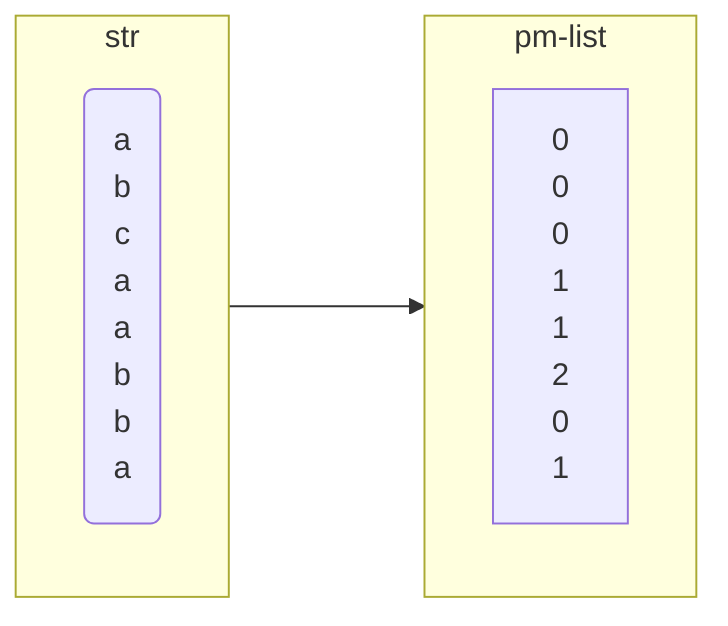
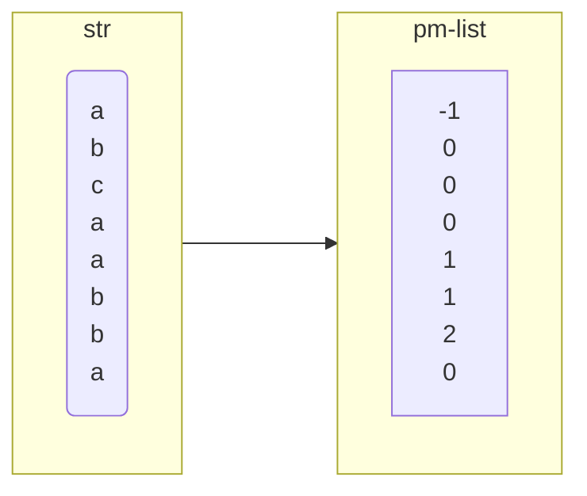

# 关于 KMP 算法的理解

假设现在有一个子串`str = "abcaabba"`

## 前缀表

该子串的最简单前缀表`pm-list`为`(0,0,0,1,1,2,0,1)`,`pm-list`中每一个位置的元素表示当前位置之前(包括当前位置上的字符),最长的相同前后缀的长度.
在 ***KMP*** 算法中,需要每次滑动的距离为`pm-list[j-1]`,也即子串和母串第一个匹配到不相等位置`j`在`pm-list[j]`的前一个.
例如如果匹配的母串为`abcdefefefefef`,则在匹配到母串的第一个`e`时,`j=3`,此时查`pm-list[j-1]`即`pm-list[2] = 0`



## 改进——使用`next`数组

`getNext`函数是一个经典的改进版本,其本质是把`pm-list`全体元素右移后
再在第一个位置添`-1`,而原来`pm-list`的最后一个元素则可以保留也可以舍去,
这里是因为在`pm-list`的匹配时只需要查不匹配位置的前一个值,所以`pm-list`中的最后一个值始终是不会用到的.



## 改进——使用`nextVal`数组

在`next`数组中,仍然存在这种情况.
匹配到第2个`b (str[5])`,查`next`得子串滑动1单位,则子串滑动到第一个`b (str[1])`继续匹配,但是这显然是不匹配的,
因为在上一轮中我们已经知道第2个`b (str[5])`不匹配,则第一个`b (str[1])`也不可能匹配,所以此时直接让子串滑动到开头即可.

改进`next`数组,我们叫做`nextVal`,让`nextVal`避免上述问题即可.在`next`的基础上每次为`next`的元素赋值后,使用`tmp`向前迭代,模拟`str[i]`位置不匹配时`str`滑动`next[i]`个位置后的匹配情况,如果`str[i] != str[tmp]`,则表明此位置可能与母串可以匹配,将`next[i]`更新为该位置.循环上述过程就得到了更新后的`nextVal`数组.

```cpp
std::vector<int> getNextVal(const std::string & str)
{
    std::vector<int> nextVal(str.size(), 0);
    nextVal[0] = -1;
    auto i = 0, prefix_len = -1;
    auto tmp = 0;
    // prefix_len 代表前后缀已匹配的长度
    while( i < str.size()-1 )
    {
        // prefix_len == -1 意味着前后缀匹配为空(无匹配)
        if(prefix_len==-1 || str[i]==str[prefix_len])
        {
            nextVal[++i] = ++prefix_len;
            
            /* 
            tmp 向前迭代,模拟 str[i] 位置不匹配时 
            str 滑动 next[i] 个位置后的匹配情况
            如果 str[i] != str[tmp],则表明此位置可能与母串可以匹配,将 next[i] 更新为该位置
            */
            tmp = i;
            while(tmp >= 0 && str[i] == str[tmp])
            {
                tmp = nextVal[tmp];
            }
            nextVal[i] = tmp;
        }
        else
        {
            prefix_len = nextVal[prefix_len];
        }
    }
    return nextVal;
}
```
