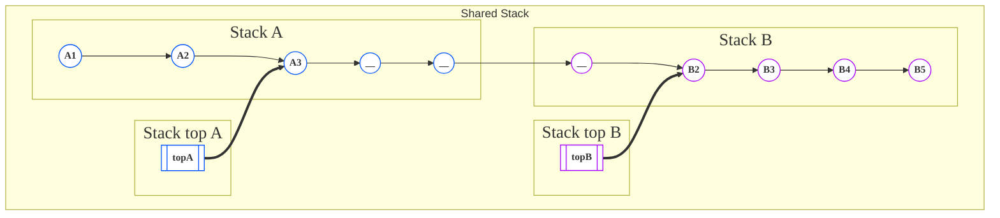

# A Shared Stack

>the topA and topB are the top of the stack A and B respectively.
topA go right and topB go left.

---

```mermaid
flowchart
    classDef dotA fill:#fff,stroke:#05f ,stroke-width:1.2px,font-family:Times New Roman ,font-size:14px , font-weight: bold;
    classDef dotB fill:#fff ,stroke:#a0f ,stroke-width:1.2px , font-family:Times New Roman ,font-size:14px , font-weight: bold;
    classDef Title font-family:Times New Roman ,font-size:24px;
    subgraph Shared-Stack["Shared Stack"]
        direction LR
        topA:::dotA
        topB:::dotB
        A1:::dotA
        A2:::dotA
        A3:::dotA
        A4:::dotA
        A5:::dotA
        B1:::dotB
        B2:::dotB
        B3:::dotB
        B4:::dotB
        B5:::dotB
        Stack-A:::Title
        Stack-B:::Title
        Stack-top-A:::Title
        Stack-top-B:::Title
        A5-->B1
        subgraph Stack-A["Stack A"]
            direction LR
            A1((A1))-->A2((A2))-->A3((A3))-->A4((__))-->A5((__))
        end
        subgraph Stack-B["Stack B"]
            direction RL
            B1((__))-->B2((B2))-->B3((B3))-->B4((B4))-->B5((B5))
        end
        subgraph Stack-top-A["Stack top A"]
            direction LR
            topA[[topA]]==>A3
        end
        subgraph Stack-top-B["Stack top B"]
            direction RL
            topB[[topB]]==>B2
        end
    end
```
