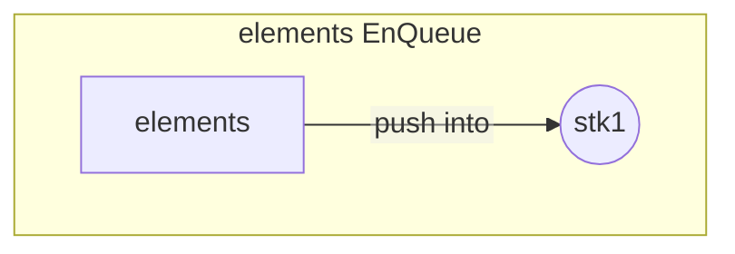
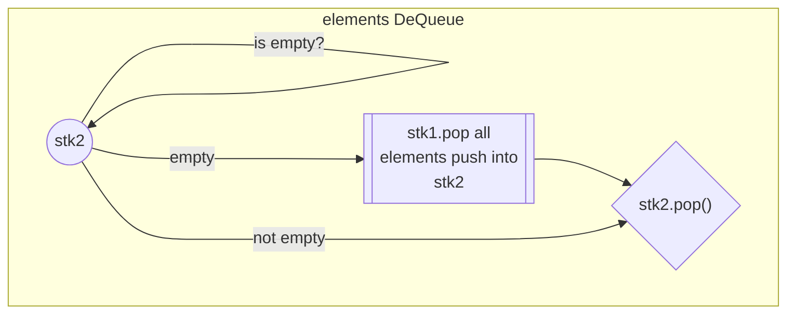

# Use Stack Simulate Queue

>A queue can be simulated using two stacks. Let queue to be simulated by using stack1(stk1) and stack2(stk2). A queue can be implemented in a way below:

---

```mermaid
%%{init: {"flowchart": {"htmlLabels": false}} }%%
flowchart TB
    subgraph elements EnQueue
    elem[elements]--push into -->stk1((stk1))
    end
```

```mermaid
flowchart TB
    subgraph elements DeQueue
        stk2((stk2))-- is empty?-->stk2
        stk2--empty--->stk1_pop[["stk1.pop all 
        elements push into 
        stk2"]]-->out{"stk2.pop()"}
        stk2--not empty-->out
    end
```
